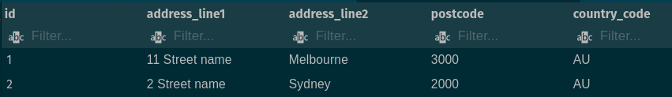

# Understanding tables

- Flat storage (Columns & rows)
- Primary Keys
- Data types

## Flat storage

Think of a house

```json
{
  "id": 1,
  "address_line1": "11 street name",
  "address_line2": "Melbourne",
  "postcode": "3000",
  "state": "VIC",
  "country_code": "AU"
}
```

```sql
-- Delete table
DROP TABLE IF EXISTS houses;
-- Create table
CREATE TABLE houses (
    id SERIAL,
    address_line1 VARCHAR,
    address_line2 VARCHAR,
    postcode VARCHAR,
    country_code VARCHAR,

    PRIMARY KEY (id)
);
```



## How to represent heirachial data?

What about if the house has windows?

```json
{
  "id": 1,
  "address_line1": "11 street name",
  "address_line2": "Melbourne",
  "postcode": "3000",
  "state": "VIC",
  "country_code": "AU",
  "windows": [
    {
      "id": 1001,
      "width_mm": 200,
      "height_mm": 200
    },
    {
      "id": 1002,
      "width_mm": 200,
      "height_mm": 200
    },
    {
      "id": 1003,
      "width_mm": 200,
      "height_mm": 200
    }
  ]
}
```

```sql
-- Create table
CREATE TABLE house_windows (
    id SERIAL PRIMARY KEY,
    house_id INTEGER,
    height_mm INTEGER,
    width_mm INTEGER,

    PRIMARY KEY (id)
);
```

Insert House and window data

```sql
-- First house and windows
INSERT INTO houses (address_line1, address_line2, postcode, country_code)
VALUES ('11 Street name', 'Melbourne', '3000', 'AU');

INSERT INTO house_windows (house_id, height_mm, width_mm)
VALUES (1, 200, 300);

INSERT INTO house_windows (house_id, height_mm, width_mm)
VALUES (1, 200, 600);

-- Second house and windows
INSERT INTO houses (address_line1, address_line2, postcode, country_code)
VALUES ('2 Street name', 'Sydney', '2000', 'AU');

INSERT INTO house_windows (house_id, height_mm, width_mm)
VALUES (2, 200, 300);

INSERT INTO house_windows (house_id, height_mm, width_mm)
VALUES (2, 200, 600);
```

List all windows for a specific house by `house_id`

```sql
SELECT * FROM house_windows where house_id = 1;

SELECT * FROM house_windows
  WHERE width_mm > 300;
```


### Relationships between tables

```sql
-- Create table
CREATE TABLE house_windows (
    id SERIAL,
    house_id INTEGER,
    height_mm INTEGER,
    width_mm INTEGER,

    PRIMARY KEY (id),
    FOREIGN KEY (house_id) REFERENCES houses(id)
);

-- Re-add house windows

INSERT INTO house_windows (house_id, height_mm, width_mm)
VALUES (1, 200, 300);

INSERT INTO house_windows (house_id, height_mm, width_mm)
VALUES (1, 200, 600);

INSERT INTO house_windows (house_id, height_mm, width_mm)
VALUES (2, 200, 300);

INSERT INTO house_windows (house_id, height_mm, width_mm)
VALUES (2, 200, 600);
```


