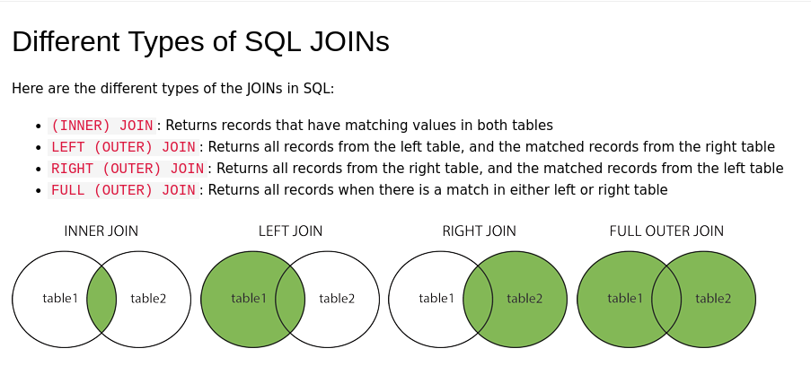

# Joining tables

- inner joins
- left joins
- right joins
- full outer joins



Source https://www.w3schools.com/sql/sql_join.asp

## Inner joins

```sql
SELECT * FROM houses
  INNER JOIN house_windows ON houses.id = house_windows.house_id
  WHERE houses.id = 2;
```

```sql
SELECT * FROM houses
  INNER JOIN house_windows ON houses.id = house_windows.house_id
  WHERE houses.id = 2
  AND house_windows.width_mm > 300;
```
